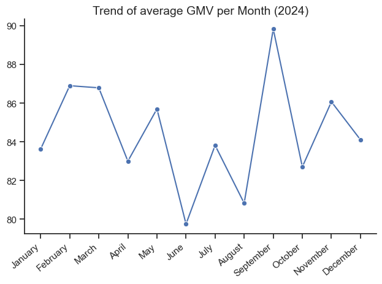
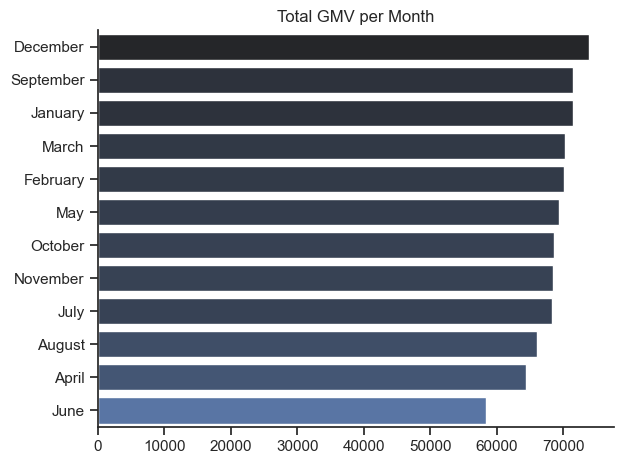
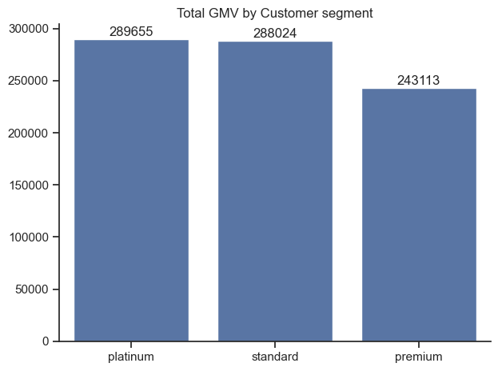
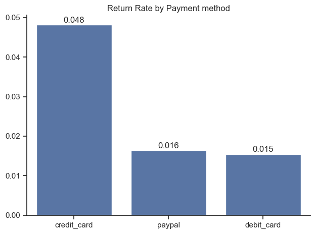
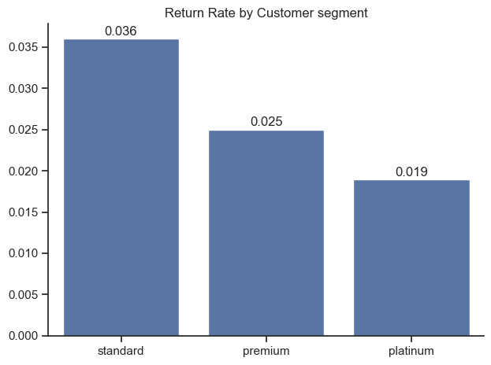
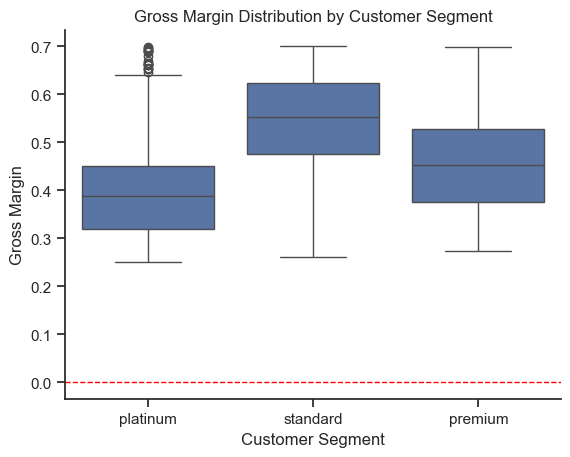

# Project Overview

## Objectives
- To analyze and give accurate representation of sales performance,customer value and operational efficiency on the lsited key KPIs

## Data Preparation
- Checked the shape of the datasets to see its amount of columns and rows
- Converted columns like 'date' to the proper method and data type for analysis
- Identified columns/rows with missing values and dropped these rows to avoid wrong results
- Identifed and droped duplicate datasets
- Added new relevant columns with corresponding rows that are neede for analysis
- View Notebook for the detailed steps showing data cleaning sequence and visualization:
[dtCleaning.ipynb](dtCleaning.ipynb)

## Inference from Analysis

### 1. What is the trend of the average monthly GMV ?
To do this, I filtered the cleaned dataset and selected the columns with the month names and amount of orders, then used seaborn to make a barplot from the dataset

#### Results:

*linegraph visualizing the average GMV trend by month for DataFlow Inc., 2024.*

#### Insights:
- Highest average GMV in September while lowest in June
- Influence on this trend might be attributed to the dominance of premium, platinum customers orders

### 2. What is the sum/raw total GMV per Month ?
To do this, I filtered the cleaned dataset and selected the columns with month names and orders. I grouped the sum of these order amount by the month names column. To get the raw sum per month in the descending order, I sorted the sum total of the order amounts per month.

#### Results:

*barchart showing the sum/raw total GMV breakdown per month for DataFlow Inc., 2024.*

#### Insights:
- Highest total GMV by raw count (sum) is found in December and lowest in June
- Most months have sum total GMV within the 65,000 - 70,000 range. This shows consistency and good health of the business due to no heavy fluctuations

### 3. What is the total GMV by Customer Segment ?
To do this, I filtered the cleaned dataset and selected the columns with the customer segment and amount of orders. I grouped the sum of these orders by the Customer segment column, then sorted the values in descending order.

#### Results:

*barchart showing the sum/raw total GMV breakdown per Customer segment for DataFlow Inc., 2024.*

#### Insights:
- Highest total GMV here is found in Platinum by a small margin while Premium recored the lowest

### 4. What is the return rate by payment methods ?
To do this, I filtered the cleaned dataset and grouped the payment methods by the sum of returned orders. I proceeded to divide the values by the total number of orders to get the return rate of each payment method

#### Results:

*barchart showing the return rate breakdown per payment method for DataFlow Inc., 2024.*

#### Insights: 
- Transactions made by Credit cards have a higher return rates, 3x more, than other payment methods
- Return rates for both paypal and debit cards are almost similar and stable

### 5. What is the return rate by customer segments ?
To do this, I filtered the cleaned dataset, selected and grouped the customer segments by the sum of returned orders. I proceeded to divide the values by the total number of orders to get the return rate of each payment method

#### Results:

*barchart showing the return rate breakdown per Customer segment for DataFlow Inc., 2024.*

#### Insights:
- Highest return rates for customer segment is found in Standard customer types while the Platinum customer types remains stable

### 6. What is the gross margin distribution by Customer segment ?
To do this, I filtered and selected the appropraite columns needed for the analysis. I proceeded to calculate the gross margin by dividing the difference between the amount of orders and cost, by the amount of orders. Finally, I plotted the customer segemnt against the gross margin

#### Results:

*boxplot showing the Gross margin distribution by Customer segment for DataFlow Inc., 2024.*

#### Insights:
- While the Standard customer segment has a slightly lower total GMV than the Platinum's (as per the analysis: **visualization 3**), the Gross margin distribution chart shows that the Standard segment has the highest median gross margin, of above 0.5.